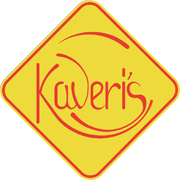

# 🍽️ Kaveri Restaurant - Next.js Website

A stunning, professional restaurant website built with Next.js 16, featuring three outlet locations, dynamic content, and a premium gallery.



## ✨ Features

### 🏛️ **Multi-Outlet Support**
- **Ashok Nagar** - Flagship location with amber gold theme
- **Kanke Road** - Modern outlet with sky blue accents  
- **Ratu Road** - Family-friendly branch with emerald green theme
- Dynamic header/footer that changes based on selected location

### 🎨 **Premium Gallery**
- Dual view modes: Bento Grid & Masonry Layout
- Category filtering (All, Ambiance, Culinary Arts, Interiors, Celebrations)
- Advanced lightbox with keyboard navigation
- 28+ real restaurant images
- Smooth animations and transitions

### 📱 **Fully Responsive**
- Mobile-first design
- Touch-friendly interactions
- Optimized for all screen sizes
- Perfect on phones, tablets, and desktops

### 🎯 **Modern Tech Stack**
- **Next.js 16.1.1** with App Router
- **React 19.2.3** with Server Components
- **TailwindCSS 4** for styling
- **Turbopack** for fast builds
- Custom animations and effects

### 🌟 **Design Highlights**
- Professional dark theme for gallery
- Golden accent colors (#d4af37)
- Playfair Display serif font for headings
- Jost sans-serif for body text
- Smooth hover effects and transitions
- Ken Burns effect on hero images

## 📂 Project Structure

```
kaveri-nextjs/
├── app/
│   ├── ashok-nagar/     # Ashok Nagar outlet page
│   ├── kanke-road/      # Kanke Road outlet page
│   ├── ratu-road/       # Ratu Road outlet page
│   ├── gallery/         # Gallery page with lightbox
│   ├── menu/            # Menu page
│   ├── layout.js        # Root layout with fonts
│   └── page.js          # Landing page
├── components/
│   ├── Header.js        # Dynamic header with location selector
│   ├── Footer.js        # Dynamic footer with outlet info
│   ├── Hero.js          # Ken Burns carousel
│   ├── Gallery.js       # Gallery component
│   └── ...
├── data/
│   └── locations.js     # Outlet data (addresses, phones, etc.)
├── public/
│   └── assets/          # Images for all outlets
└── context/
    ├── ModalContext.js  # Modal state management
    └── ShopContext.js   # Cart/wishlist state
```

## 🚀 Getting Started

### Prerequisites
- Node.js 18+ installed
- npm or yarn

### Installation

1. **Clone the repository**
```bash
git clone https://github.com/YOUR_USERNAME/kaveri-restaurant.git
cd kaveri-restaurant
```

2. **Install dependencies**
```bash
npm install
```

3. **Run development server**
```bash
npm run dev
```

4. **Open in browser**
```
http://localhost:3000
```

## 📦 Available Scripts

```bash
npm run dev     # Start development server (Turbopack)
npm run build   # Create production build
npm start       # Start production server
npm run lint    # Run ESLint
```

## 🎨 Color Palette

- **Primary Gold**: `#d4af37` - Main accent color
- **Light Gold**: `#f9e29c` - Gradient highlights  
- **Dark Gold**: `#b8860b` - Darker accent
- **Background**: `#fafaf9` (stone-50) - Light theme
- **Dark Background**: `#0c0a09` (stone-950) - Gallery theme
- **Text**: `#1c1917` (stone-900) - Primary text

## 🗺️ Outlet Information

### Ashok Nagar
- **Address**: Freds Palace, Opp Road No.3, Ranchi-834002
- **Phones**: +91-84092 11101, +91-84097 11101
- **Email**: info@thekaveris.com
- **Hours**: Mon - Sat 9AM TO 9PM

### Kanke Road  
- **Address**: Ground Floor, Shop No.6, Astor Green, Chandani Chowk, Kanke Road, Ranchi-834008
- **Phones**: +91-7781000533, +91-7781000534
- **Email**: info@thekaveris.com
- **Hours**: Mon - Sat 9AM TO 9PM

### Ratu Road
- **Address**: Ayodhya Apartment Shivaji Park, Alkem lab, Hehal Ratu Road, Ranchi-834005
- **Phones**: +91-90319 24777, +91-90319 23777
- **Email**: info@thekaveris.com
- **Hours**: Mon - Sat 9AM TO 9PM

## 🌐 Deployment

See [DEPLOYMENT.md](DEPLOYMENT.md) for detailed deployment instructions to Vercel or Netlify.

**Quick Deploy:**
```bash
# Push to GitHub
git push origin main

# Deploy to Vercel
# Visit vercel.com, import repository, and deploy!
```

## 📝 TODO / Future Enhancements

- [ ] Online ordering system
- [ ] Table reservation backend
- [ ] Menu management admin panel
- [ ] Customer reviews integration
- [ ] Email newsletter signup
- [ ] Multiple language support
- [ ] Payment gateway integration

## 🤝 Contributing

Contributions are welcome! Please feel free to submit a Pull Request.

## 📄 License

This project is private and proprietary to Kaveri Restaurant.

## 📞 Contact

**Kaveri Restaurant**
- Website: [Coming Soon]
- Email: info@thekaveris.com
- Phone: +91-84092 11101

---

**Built with ❤️ using Next.js**

*Pure Vegetarian Fine Dining Since 1992*
